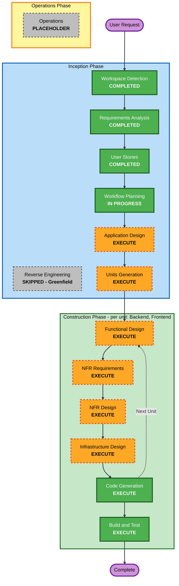

# Execution Plan - QuickChat

## Detailed Analysis Summary

### Change Impact Assessment
- User-facing changes: Yes - 메신저 전체(인증, DM, 채널, 실시간 전송, 상태, 이력)가 사용자 대면 기능
- Structural changes: Yes - 신규 시스템(Greenfield), 백엔드/프론트엔드/인프라 전체 신규 구축
- Data model changes: Yes - User, Channel, ChannelMember, Message 등 신규 데이터 모델
- API changes: Yes - 신규 REST API + WebSocket(STOMP) API
- NFR impact: Yes - 성능(p50 500ms), 가용성(99.5%), 보안(JWT/TLS/Vault), 테스트(PBT Full Enforcement)

### Risk Assessment
- Risk Level: Medium (다중 인프라 컴포넌트(K8s/Kafka/Redis/Vault) 통합 필요, 팀이 K8s/Kafka를 처음 다룸 - tech-env.md - 이나 실습/데모 성격상 프로덕션 크리티컬은 아님)
- Rollback Complexity: Moderate (신규 구축이라 기존 시스템 영향 없음, 컨테이너 재배포로 롤백 가능)
- Testing Complexity: Moderate (WebSocket 실시간성 + PBT 전체 규칙 적용으로 예시 기반 테스트보다 범위가 넓음)

## Workflow Visualization

### Mermaid Diagram



### Text Alternative

```
INCEPTION PHASE
- Workspace Detection: COMPLETED
- Reverse Engineering: SKIPPED (Greenfield)
- Requirements Analysis: COMPLETED
- User Stories: COMPLETED
- Workflow Planning: IN PROGRESS
- Application Design: EXECUTE
- Units Generation: EXECUTE

CONSTRUCTION PHASE (Backend, Frontend 유닛별로 반복)
- Functional Design: EXECUTE
- NFR Requirements: EXECUTE
- NFR Design: EXECUTE
- Infrastructure Design: EXECUTE
- Code Generation: EXECUTE (always)
- Build and Test: EXECUTE (always, 모든 유닛 완료 후)

OPERATIONS PHASE
- Operations: PLACEHOLDER
```

## Phases to Execute

### Inception Phase
- [x] Workspace Detection (COMPLETED)
- [x] Reverse Engineering (SKIPPED - Greenfield)
- [x] Requirements Analysis (COMPLETED)
- [x] User Stories (COMPLETED)
- [x] Workflow Planning (IN PROGRESS)
- [ ] Application Design - EXECUTE
  - Rationale: 단일 Spring Boot 서비스 내부를 Auth/Channel/Messaging/Presence 등 컴포넌트로 나누고, 메시지 전송처럼 여러 컴포넌트(채널 멤버십 확인 -> 저장 -> Kafka 발행 -> Redis Pub/Sub -> WebSocket 브로드캐스트)를 가로지르는 흐름의 책임과 의존관계를 먼저 정리할 필요가 있음
- [ ] Units Generation - EXECUTE
  - Rationale: tech-env.md 기준 Backend(Spring Boot)와 Frontend(Next.js)가 별도 배포 단위이며 병렬 진행 가능한 최소 2개 유닛으로 분해 필요

### Construction Phase (유닛별: Backend, Frontend)
- [ ] Functional Design - EXECUTE
  - Rationale: 채널 공개/초대 정책, 메시지 저장/조회, 프론트 상태 관리 등 신규 비즈니스 로직 존재. PBT-01(테스트 가능한 속성 식별)도 이 단계에서 수행
- [ ] NFR Requirements - EXECUTE
  - Rationale: 성능(p50 500ms, 500 동시접속), 확장성(멀티 파드 WebSocket), PBT 프레임워크 선택(PBT-09) 등 유닛별 NFR 확정 필요
- [ ] NFR Design - EXECUTE
  - Rationale: Redis Pub/Sub 기반 멀티 파드 세션 동기화, Kafka 기반 비동기 처리 등 NFR 패턴을 설계에 반영
- [ ] Infrastructure Design - EXECUTE
  - Rationale: 자체 NAS/k3s, Kafka(KRaft), Redis, Vault를 실제 서비스로 매핑하고 NAS 리소스 부족 시 Docker Compose 축소 기준(Requirements Open Item) 결정
- [ ] Code Generation - EXECUTE (ALWAYS)
  - Rationale: 실제 백엔드/프론트엔드 코드와 테스트(example-based + PBT) 생성
- [ ] Build and Test - EXECUTE (ALWAYS)
  - Rationale: 유닛 간 통합(백엔드 API-프론트엔드 연동) 검증 및 빌드/테스트 안내서 필요

### Operations Phase
- [ ] Operations - PLACEHOLDER
  - Rationale: 현재 버전에서는 향후 확장을 위한 자리표시자

## Estimated Timeline
- Total Remaining Stages: 2 (Inception: Application Design, Units Generation) + 유닛(Backend/Frontend) x 6 (Construction) stages
- Estimated Duration: 정확한 시간 추정보다 실습 회차 단위 참고 - Inception 잔여 단계는 1회 세션 내 가능, Construction은 유닛당 별도 세션 권장 (실습 목적, 정밀한 일정 추정 아님)

## Success Criteria
- Primary Goal: vision.md MVP 성공 기준(1:1/그룹 실시간 메시징 동작) 시연 + AI-DLC 요구사항 -> 설계 -> 코드 흐름 시연
- Key Deliverables: Application Design 문서, Backend/Frontend 유닛 정의, 유닛별 설계/코드/테스트, Build and Test 안내서
- Quality Gates: vision.md MVP Definition of Done 충족, requirements.md 비기능 요구사항(성능/보안) 충족, PBT-01~10 Full Enforcement 준수
